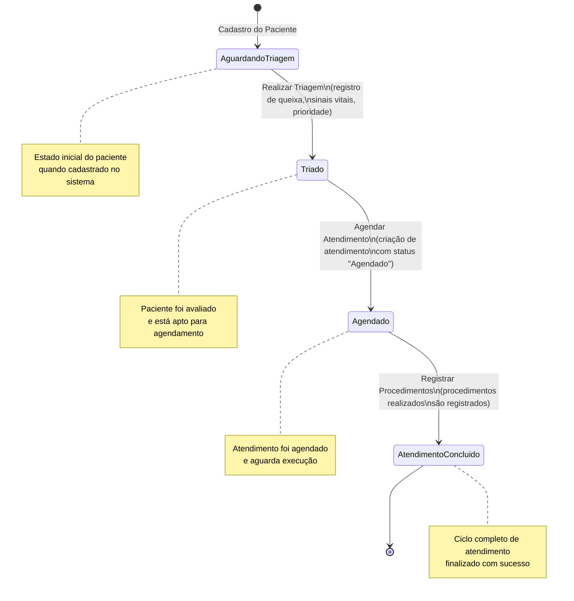
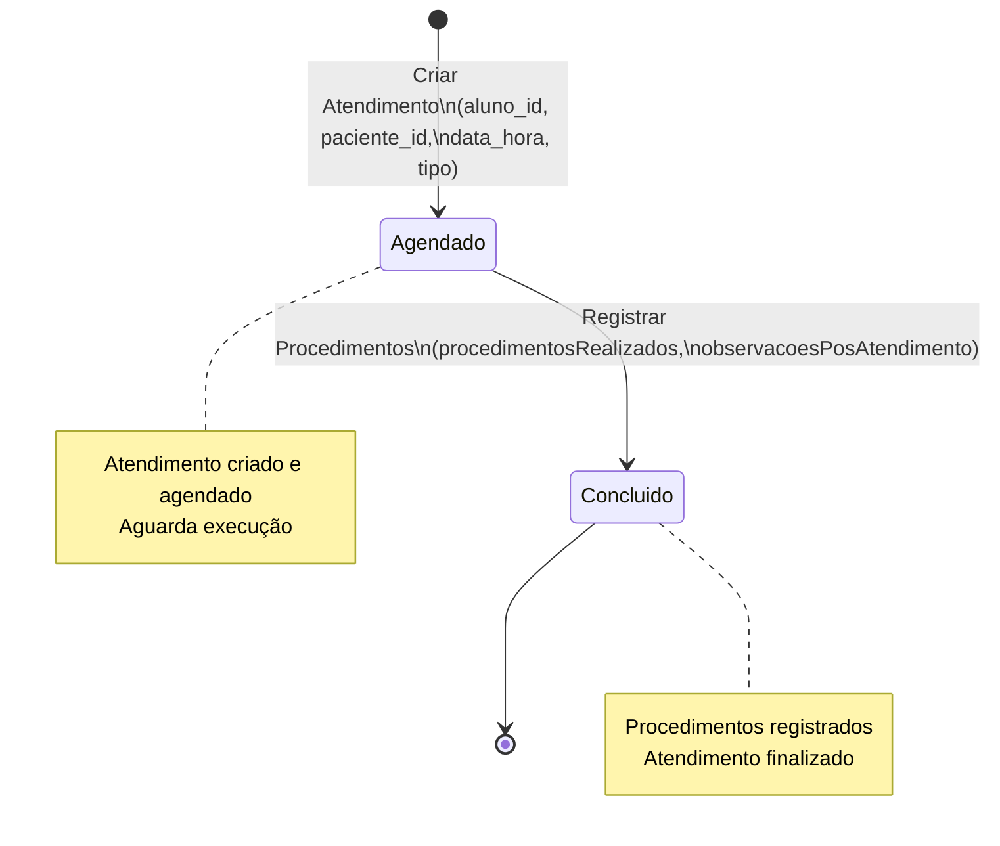
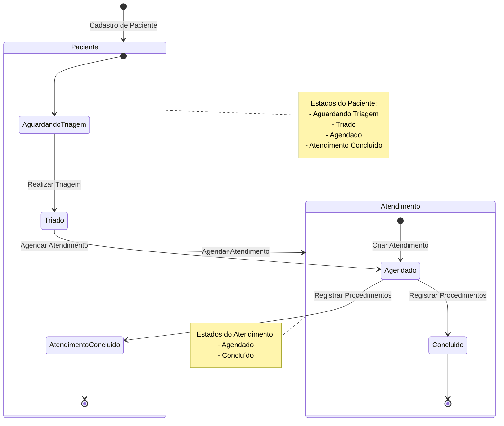

# Diagrama de Estados - CliniSys

## Visão Geral
Este documento apresenta o diagrama de estados do sistema CliniSys, mostrando os fluxos de estado tanto para **Pacientes** quanto para **Atendimentos**.

## Estados do Paciente (statusAtendimento)

O paciente passa pelos seguintes estados durante seu ciclo de atendimento:

### 1. Aguardando Triagem
- **Estado Inicial**: Quando o paciente é cadastrado no sistema
- **Descrição**: Paciente aguarda ser chamado para triagem
- **Ações possíveis**: Realizar triagem

### 2. Triado
- **Transição**: De "Aguardando Triagem" → "Triado"
- **Gatilho**: Após a triagem ser realizada (registro de queixa, sinais vitais, prioridade)
- **Ações possíveis**: Agendar atendimento

### 3. Agendado
- **Transição**: De "Triado" → "Agendado"
- **Gatilho**: Quando um atendimento é agendado para o paciente
- **Ações possíveis**: Realizar atendimento (registrar procedimentos)

### 4. Atendimento Concluído
- **Transição**: De "Agendado" → "Atendimento Concluído"
- **Gatilho**: Após o registro dos procedimentos realizados no atendimento
- **Estado Final**: Ciclo de atendimento completo

## Estados do Atendimento (status)

O atendimento possui os seguintes estados:

### 1. Agendado
- **Estado Inicial**: Quando o atendimento é criado
- **Descrição**: Atendimento foi agendado e aguarda execução
- **Ações possíveis**: Registrar procedimentos realizados

### 2. Concluído
- **Transição**: De "Agendado" → "Concluído"
- **Gatilho**: Quando os procedimentos realizados são registrados
- **Estado Final**: Atendimento finalizado

## Diagrama de Estados - Paciente



## Diagrama de Estados - Atendimento



## Diagrama de Estados Combinado (Fluxo Completo)



## Regras de Negócio Relacionadas aos Estados

### Validações ao Agendar Atendimento
- Paciente deve estar no estado "Triado"
- Aluno e paciente devem pertencer à mesma clínica
- Data/hora deve ser futura
- Deve ser dia útil (segunda a sexta)
- Horário comercial (08:00 às 18:00)
- Paciente não pode ter outro agendamento no mesmo dia

### Validações ao Registrar Procedimentos
- Atendimento deve estar no estado "Agendado"
- Descrição dos procedimentos é obrigatória
- Ao registrar procedimentos:
  - Atendimento muda para "Concluído"
  - Paciente muda para "Atendimento Concluído"

## Transições de Estado no Código

### 1. Cadastro de Paciente → Aguardando Triagem
**Arquivo**: `backend/repositories/paciente_repository.py`
```python
statusAtendimento="Aguardando Triagem"  # Estado padrão
```

### 2. Aguardando Triagem → Triado
**Arquivo**: `backend/repositories/triagem_repository.py`
```python
# Linha 68-69
cur.execute(
    "UPDATE pacientes SET statusAtendimento = ? WHERE id = ?",
    ("Triado", dados['paciente_id'])
)
```

### 3. Triado → Agendado
**Arquivo**: `backend/services/agendamento_service.py`
```python
# Linha 206-208
update_patient_sync(
    patient_id=paciente_id,
    status_atendimento="Agendado"
)
```

### 4. Agendado → Atendimento Concluído
**Arquivo**: `backend/services/atendimento_service.py`
```python
# Linha 105-108
update_patient_sync(
    patient_id=atualizado.paciente_id,
    status_atendimento="Atendimento Concluído"
)
```

### 5. Atendimento: Agendado → Concluído
**Arquivo**: `backend/repositories/consulta_repository.py`
```python
# Linha 208
atendimento.status = "Concluído"
```

## Observações Importantes

1. **Sincronização de Estados**: O estado do paciente é atualizado automaticamente quando:
   - Uma triagem é realizada (→ "Triado")
   - Um atendimento é agendado (→ "Agendado")
   - Procedimentos são registrados (→ "Atendimento Concluído")

2. **Estado do Atendimento**: O estado do atendimento é independente, mas está relacionado ao estado do paciente:
   - Quando atendimento é criado: status = "Agendado"
   - Quando procedimentos são registrados: status = "Concluído"

3. **Validações**: O sistema valida que apenas atendimentos com status "Agendado" podem receber procedimentos.

4. **Fluxo Linear**: O fluxo de estados é linear e não permite retrocesso (exceto em casos de cancelamento, que não está implementado no código atual).

